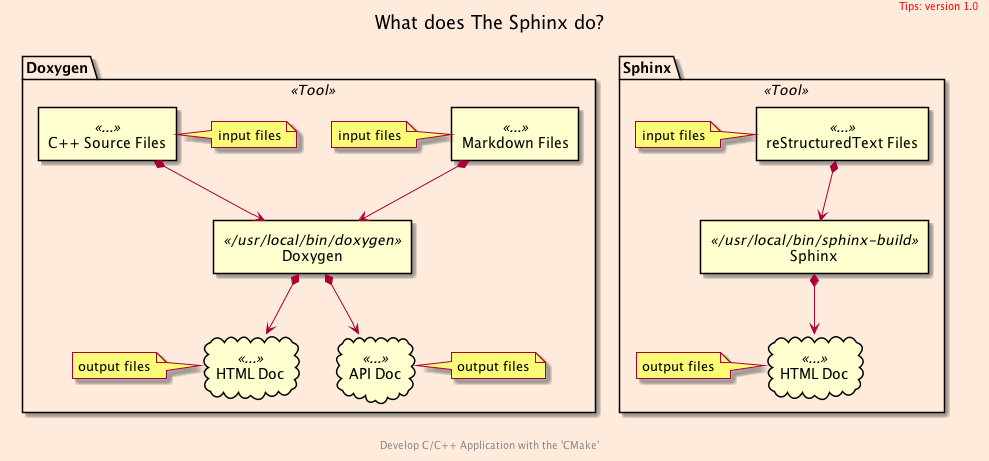

<h2>Hello, <code>Module</code>!</h2>
<h3>Using Your Custom CMake-Find Module</h3>
</br>
</br>

[@Gitter](https://gitter.im/cnruby) :gitter.im/cnruby<br/>
Code ID: basic_119</br>
Code Name: Hello, Module!</br>
<p class ="fragment" data-audio-src="docs/119/audio/basic_119-01.m4a"></p>


<h2>TABLE of CONTENTS</h2>

- [Requirements](#requirements)
  - [Install Sphinx and Its Theme on MacOS](#install-sphinx-and-its-theme-on-macos)
- [About The Project](#about-the-project)
  - [What does The Sphinx do?](#what-does-the-sphinx-do)
  - [Get The Code with Shell Commands](#get-the-code-with-shell-commands)
  - [The <code>Folder's</code> Structure](#the-folders-structure)
- [Using The Module <code>'FindSphinx'</code>](#using-the-module-findsphinx)
  - [The Listfile of Folder <code>'cmake/sphinx'</code>](#the-listfile-of-folder-cmakesphinx)
  - [The <code>Process's</code> Structure](#the-processs-structure)
- [Generating The 'Sphinx's Documentation](#generating-the-sphinxs-documentation)
  - [The <code>Command's</code> Structure](#the-commands-structure)
  - [What is The Command for Generating 'Sphinx's Documentation](#what-is-the-command-for-generating-sphinxs-documentation)
  - [Illustrate Generating 'Sphinx's Documentation](#illustrate-generating-sphinxs-documentation)
- [Final Summary](#final-summary)
- [References](#references)
<div class ="fragment" data-audio-src="docs/119/audio/basic_119-02.m4a"></div>


## Requirements
- [VS Code 1.43.0+](https://code.visualstudio.com/)
- [CMake 3.17.0+](https://cmake.org/)
- [Python 3.7+](https://www.python.org/)
- [Tool Sphinx](https://www.sphinx-doc.org/)
- [Sphinx bootstrap theme](https://github.com/ryan-roemer/sphinx-bootstrap-theme)
- [VCS Code Extension: reStructuredText](https://marketplace.visualstudio.com/items?itemName=lextudio.restructuredtext)
<div class ="fragment" data-audio-src="docs/119/audio/basic_119-03.m4a"></div>


### Install Sphinx and Its Theme on MacOS
```bash
brew install sphinx-doc
pip install sphinx sphinx-autobuild
pip install sphinx_bootstrap_theme
```
<div class ="fragment" data-audio-src="docs/119/audio/basic_119-04.m4a"></div>


## About The Project

<p class ="fragment" data-audio-src="docs/119/audio/basic_119-05.m4a"></p>


### What does The Sphinx do?

<div class ="fragment" data-audio-src="docs/119/audio/basic_119-06.m4a"></div>


### Get The Code with Shell Commands
```bash
git clone https://github.com/cnruby/w3h1_cmake.git basic_119
cd basic_119
git checkout basic_119
code .
```
<div class ="fragment" data-audio-src="docs/119/audio/basic_119-07.m4a"></div>


```bash
#<!-- markdown-exec(cmd:cat docs/output/tree.txt) -->#
.
├── api
│  ├── conf.py
│  └── index.rst
├── cmake
│  ├── CMakeLists.txt
│  ├── module
│  │  └── FindSphinx.cmake
│  └── sphinx
│     └── CMakeLists.txt
├── CMakeLists.txt
├── lib
│  ├── CMakeLists.txt
│  ├── header.cxx
│  └── header.hxx
└── src
   ├── CMakeLists.txt
   └── main.cxx
#<!-- /markdown-exec -->
```
### The <code>Folder's</code> Structure
<p class ="fragment" data-audio-src="docs/119/audio/basic_119-08.m4a"></p>


## Using The Module <code>'FindSphinx'</code>
'FindSphinx'" height="70%" width="70%">
<p class ="fragment" data-audio-src="docs/119/audio/basic_119-09.m4a"></p>


```bash
#<!-- markdown-exec(cmd:cat cmake/sphinx/CMakeLists.txt) -->#
message(STATUS "^BEGIN FROM cmake/sphinx/CMakeLists.txt")
set(BUILD_DOC_SPHINX ${PROJECT_SOURCE_DIR}/build-doc-sphinx)

find_package(Sphinx REQUIRED QUIET)
if (SPHINX_FOUND)
  message("-- Build the Sphinx HTML documentation.")
  set(SPHINX_INPUT_DIR ${PROJECT_SOURCE_DIR}/api/)
  set(SPHINX_OUTPUT_DIR ${BUILD_DOC_SPHINX}/_build)
  sphinx_add_docs(
    target_sphinx
    ${SPHINX_INPUT_DIR}
    ${SPHINX_OUTPUT_DIR}
  )
else()
  message("-- Failed to find Sphinx, disabling build of documentation.")
endif()
message(STATUS "SPHINX_VERSION\t\t= ${SPHINX_VERSION}")
message(STATUS "SPHINX INPUT DIR\t\t= ${SPHINX_INPUT_DIR}")
message(STATUS "SPHINX OUTPUT DIR\t\t= ${BUILD_DOC_SPHINX}")
message(STATUS "$END FROM cmake/sphinx/CMakeLists.txt")
#<!-- /markdown-exec -->
```
### The Listfile of Folder <code>'cmake/sphinx'</code>
<p class ="fragment" data-audio-src="docs/119/audio/basic_119-10.m4a"></p>


### The <code>Process's</code> Structure
<p class ="fragment" data-audio-src="docs/119/audio/basic_119-11.m4a"></p>


## Generating The 'Sphinx's Documentation

<p class ="fragment" data-audio-src="docs/119/audio/basic_119-12.m4a"></p>


### The <code>Command's</code> Structure

<p class ="fragment" data-audio-src="docs/119/audio/basic_119-13.m4a"></p>


### What is The Command for Generating 'Sphinx's Documentation
```bash
# Where do The Commands for generate docs come from
cmake --build build/ --target help
# Generate 'Sphinx's Documentation
cmake --build build --target target_sphinx
# Open 'Sphinx's Documentation
open build-doc-sphinx/_build/index.html
```
<div class ="fragment" data-audio-src="docs/119/audio/basic_119-14.m4a"></div>


### Illustrate Generating 'Sphinx's Documentation
<video width="720" height="480" controls data-autoplay>
  <source src="docs/119/video/basic_119-15.mov" autoplay=true type="video/mp4">
</video>


## Final Summary
<p class ="fragment" data-audio-src="docs/119/audio/basic_119-16.m4a"></p>


<h1><!-- markdown-exec(cmd:echo "感谢大家观看!") -->感谢大家观看!<!-- /markdown-exec --></h1>

@Gitter: gitter.im/cnruby<br/>

@Github: github.com/cnruby<br/>

@Twitter: twitter.com/cnruby<br/>

@Blogspot: cnruby.blogspot.com


## References
- https://www.sphinx-doc.org/en/master/usage/installation.html
- https://devblogs.microsoft.com/cppblog/clear-functional-c-documentation-with-sphinx-breathe-sphinx-cmake/
- https://github.com/InsightSoftwareConsortium/ITKExamples/blob/master/CMake/FindSphinx.cmake
- https://eb2.co/blog/2012/03/sphinx-and-cmake-beautiful-documentation-for-c---projects/
- https://stackoverflow.com/questions/26464879/how-to-build-cmake-documentation-with-sphinx
- https://cmake.org/pipermail/cmake/2009-February/027365.html
- http://macappstore.org/sphinx/
- http://www.sphinx.nl/
- http://macappstore.org/sphinx/
- http://macappstore.org/graphviz-2/
- http://graphviz.org/
- https://stackoverflow.com/questions/24488250/check-graphviz-installed-version-on-ubuntu
- https://github.com/TartanLlama/cpp-documentation-example
- https://www.sphinx-doc.org/en/master/usage/quickstart.html
- https://github.com/akheron/jansson/blob/master/cmake/FindSphinx.cmake
- https://github.com/InsightSoftwareConsortium/ITKExamples/blob/master/CMake/FindSphinx.cmake
- https://gitlab.cern.ch/dss/eos/blob/1fda896069c59c8ab414770363a6bee94e4ad013/cmake/FindSphinx.cmake
- https://raw.githubusercontent.com/llvm-mirror/llvm/master/cmake/modules/FindSphinx.cmake
- https://ceres-solver.googlesource.com/ceres-solver/+/refs/tags/1.12.0rc4/CMakeLists.txt
- https://ceres-solver.googlesource.com/ceres-solver/+/refs/tags/1.12.0rc4/cmake/FindSphinx.cmake