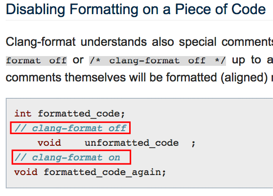

basic_108<br/>
<h3>Hello, <code>C++</code> Style!<h3>
<h1>Formatting the <code>'C/C++'s</code> Codes</h1>

[@Gitter](https://gitter.im/cnruby) :gitter.im/cnruby<br/>
<p class ="fragment" data-audio-src="docs/108/audio/basic_108-00.m4a"></p>


* [Youtube Video](https://youtu.be/uN6OollV1xo)


<h2>TABLE of CONTENTS</h2>

- [Requirements](#requirements)
- [How to Install A Tool <code>'clang-format'</code> of Formatting <code>C/C++</code> Code](#how-to-install-a-tool-clang-format-of-formatting-cc-code)
- [Get the Project](#get-the-project)
- [Use the Tool <code>'clang-format'</code>](#use-the-tool-clang-format)
  - [How to Format A <code>C/C++</code> File with A Style](#how-to-format-a-cc-file-with-a-style)
  - [Demonstrate Formatting A <code>C/C++</code> File](#demonstrate-formatting-a-cc-file)
  - [How to Create the Format File <code>'.clang-format'</code> with A Style](#how-to-create-the-format-file-clang-format-with-a-style)
  - [Demonstrate Creating the Format File <code>'.clang-format'</code>](#demonstrate-creating-the-format-file-clang-format)
  - [What does The Default Style of <code>'clang-format'</code>?](#what-does-the-default-style-of-clang-format)
  - [Demonstrate the Default Style of <code>'clang-format'</code>](#demonstrate-the-default-style-of-clang-format)
- [Compare the Different Formatting Styles](#compare-the-different-formatting-styles)
  - [Code of Comparesion Styles](#code-of-comparesion-styles)
  - [Run the <code>CMake</code> Scripting Program](#run-the-cmake-scripting-program)
  - [Demonstrate Comparing the Different Formatting Styles](#demonstrate-comparing-the-different-formatting-styles)
- [How to Format All <code>C/C++</code> Files](#how-to-format-all-cc-files)
  - [Code of Formatting All Files](#code-of-formatting-all-files)
  - [Run the <code>Ruby</code> Scripting Program](#run-the-ruby-scripting-program)
  - [Demonstrate Formatting All <code>C/C++</code> Files](#demonstrate-formatting-all-cc-files)
  - [Disabling Formatting on a Piece of Code](#disabling-formatting-on-a-piece-of-code)
- [Final Summary](#final-summary)
- [References](#references)
- [C/C++ Basic Concepts](#cc-basic-concepts)
- [How to install the Tool <code>'clang-format'</code> on Ubuntu 20.04](#how-to-install-the-tool-clang-format-on-ubuntu-2004)
<p class ="fragment" data-audio-src="docs/108/audio/basic_108-01.m4a"></p>


## Requirements
- [VS Code](https://code.visualstudio.com/) OR [Eclipse Theia](https://theia-ide.org/)
- [CMake](https://cmake.org/)
- [Tool 'clang-format'](https://clang.llvm.org/docs/ClangFormatStyleOptions.html)
- [Python 3.7+](https://www.python.org/), optional
- [Tool 'cmake_format'](https://github.com/cheshirekow/cmake_format), optional
<p class ="fragment" data-audio-src="docs/108/audio/basic_108-02.m4a"></p>


## How to Install A Tool <code>'clang-format'</code> of Formatting <code>C/C++</code> Code
```bash
# MacOS 12.10 above
brew install clang-format
```
<p class ="fragment" data-audio-src="docs/108/audio/basic_108-03.m4a"></p>


## Get the Project
```bash
git clone https://github.com/cnruby/w3h1_cmake.git basic_108
cd basic_108
git checkout basic_108
code .
cmake -GNinja -Bbuild/
cmake --build build/
```
<p class ="fragment" data-audio-src="docs/108/audio/basic_108-04.m4a"></p>


## Use the Tool <code>'clang-format'</code>
<p class ="fragment" data-audio-src="docs/108/audio/basic_108-05.m4a"></p>


### How to Format A <code>C/C++</code> File with A Style
```bash
# Clang format predefined styles
# styles = ( LLVM Google Chromium Mozilla WebKit Microsoft )
clang-format -style=Google src/main.cxx
clang-format -style=Google -i src/main.cxx
```
<p class ="fragment" data-audio-src="docs/108/audio/basic_108-06a.m4a"></p>
<p class ="fragment" data-audio-src="docs/108/audio/basic_108-06b.m4a"></p>


### Demonstrate Formatting A <code>C/C++</code> File
<video width="720" height="480" controls data-autoplay>
  <source src="docs/108/video/basic_108-09.mp4" autoplay=true type="video/mp4">
</video>


### How to Create the Format File <code>'.clang-format'</code> with A Style
```bash
# the style file name must be ".clang-format"
clang-format -style=Google -dump-config
clang-format -style=Google -dump-config > .clang-format
clang-format -style=Mozilla -dump-config > .clang-format
```
<p class ="fragment" data-audio-src="docs/108/audio/basic_108-07a.m4a"></p>


### Demonstrate Creating the Format File <code>'.clang-format'</code>
<video width="720" height="480" controls data-autoplay>
  <source src="docs/108/video/basic_108-11.mp4" autoplay=true type="video/mp4">
</video>


### What does The Default Style of <code>'clang-format'</code>?
```bash
# clang-format default style 'LLVM'
clang-format -style=file src/main.cxx
```

<p class ="fragment" data-audio-src="docs/108/audio/basic_108-08a.m4a"></p>
<p class ="fragment" data-audio-src="docs/108/audio/basic_108-08b.m4a"></p>


### Demonstrate the Default Style of <code>'clang-format'</code>
<video width="720" height="480" controls data-autoplay>
  <source src="docs/108/video/basic_108-14.mp4" autoplay=true type="video/mp4">
</video>


## Compare the Different Formatting Styles
<p class ="fragment" data-audio-src="docs/108/audio/basic_108-09.m4a"></p>


### Code of Comparesion Styles
```bash
#<!-- markdown-exec(cmd:cat compare.cmake) -->#
# The File compare.cmake
set(STYLES LLVM Google Chromium Mozilla WebKit Microsoft)
foreach(style ${STYLES})
  message("C/C++ style = <<${style}>>")
  set(MAIN ${CMAKE_CURRENT_SOURCE_DIR}/src/main)
  set(CMD
      "clang-format -style=${style} ${MAIN}.cxx > \
                    ${MAIN}.${style}.cpp")
  message(${CMD})
  execute_process(COMMAND clang-format -style=${style} ${MAIN}.cxx
                  OUTPUT_FILE ${MAIN}.${style}.cpp)
endforeach()
#<!-- /markdown-exec -->
```
<p class ="fragment" data-audio-src="docs/108/audio/basic_108-10.m4a"></p>


### Run the <code>CMake</code> Scripting Program
```bash
# delete all files "src/main.*.c*"
# rm src/main.*.c*
# run the file 'compare.cmake'
cmake -P compare.cmake
```
<p class ="fragment" data-audio-src="docs/108/audio/basic_108-11a.m4a"></p>


### Demonstrate Comparing the Different Formatting Styles
<video width="720" height="480" controls data-autoplay>
  <source src="docs/108/video/basic_108-18.mp4" autoplay=true type="video/mp4">
</video>


## How to Format All <code>C/C++</code> Files
<p class ="fragment" data-audio-src="docs/108/audio/basic_108-12.m4a"></p>


### Code of Formatting All Files
```bash
#<!-- markdown-exec(cmd:cat format-clang.rb) -->#
# The File format-clang.rb
# format-clang.rb
# ls src/main.*.c*
# rm src/main.*.c*
# cmake -P compare.cmake
# ruby format-clang.rb
#EXTENSIONS = %w[cxx cpp hpp cu c h]
EXTENSIONS = %w[cxx cpp]
EXTENSIONS.each do |ext|
    puts "ext = #{ext}"
    `clang-format -style=file -i $(find . -name "*.#{ext}")`
end
#<!-- /markdown-exec -->
```
<p class ="fragment" data-audio-src="docs/108/audio/basic_108-13.m4a"></p>


### Run the <code>Ruby</code> Scripting Program
```bash
# run the file 'format-clang.rb'
ruby format-clang.rb
```
<p class ="fragment" data-audio-src="docs/108/audio/basic_108-14a.m4a"></p>


### Demonstrate Formatting All <code>C/C++</code> Files
<video width="720" height="480" controls data-autoplay>
  <source src="docs/108/video/basic_108-22.mp4" autoplay=true type="video/mp4">
</video>


### Disabling Formatting on a Piece of Code

<p class ="fragment" data-audio-src="docs/108/audio/basic_108-15.m4a"></p>


## Final Summary

<p class ="fragment" data-audio-src="docs/108/audio/basic_108-16.m4a"></p>


<h1><!-- markdown-exec(cmd:echo "感谢大家观看!") -->感谢大家观看!<!-- /markdown-exec --></h1>
@Gitter: gitter.im/cnruby<br/>
@Github: github.com/cnruby<br/>
@Twitter: twitter.com/cnruby<br/>
@Blogspot: cnruby.blogspot.com


## References
- https://github.com/KratosMultiphysics/Kratos/wiki/How-to-configure-clang%E2%80%90format
- https://leimao.github.io/blog/Clang-Format-Quick-Tutorial/
- http://clang.llvm.org/docs/ClangFormat.html
- https://marketplace.visualstudio.com/items?itemName=xaver.clang-format
- https://linuxhint.com/install-llvm-ubuntu/
- https://llvm.org/docs/GettingStarted.html
- https://clang.llvm.org/docs/ClangFormatStyleOptions.html
- command script cmake execute process shell
- https://gist.github.com/andrewseidl/8066c18e97c40086c183
- https://github.com/KratosMultiphysics/Kratos/wiki/How-to-configure-clang%E2%80%90format
- http://derekmolloy.ie/hello-world-introductions-to-cmake/
- https://marketplace.visualstudio.com/items?itemName=xaver.clang-format


## C/C++ Basic Concepts
- The GNU Compiler Collection (GCC) is a collection of compilers and libraries for C, C++, Objective-C, Fortran, Ada, Go, and D programming languages.
- LLVM is a C/C++ compiler toolset just like GCC
- LLVM can compile C, C++ and Objective-C.
- Clang provided by the LLVM toolset is able to compile C and C++ codes faster than GCC. 
- The LLVM debugger LLDB is much more memory efficient and very fast at loading symbols compared to GCC.
- LLVM supports C++11, C++14 and C++17 through libc++ and libc++ ABI projects.
- LLVM is available on Linux, Windows and Mac OS X. So it’s cross platform. 
- The default GCC compiler in Ubuntu
- The default Clang compiler in MacOS


## How to install the Tool <code>'clang-format'</code> on Ubuntu 20.04
```bash
# https://cnruby.blogspot.com/2020/04/howto-install-clang-10include-clang-and.html
sudo apt-get install clang-tools-10
```

