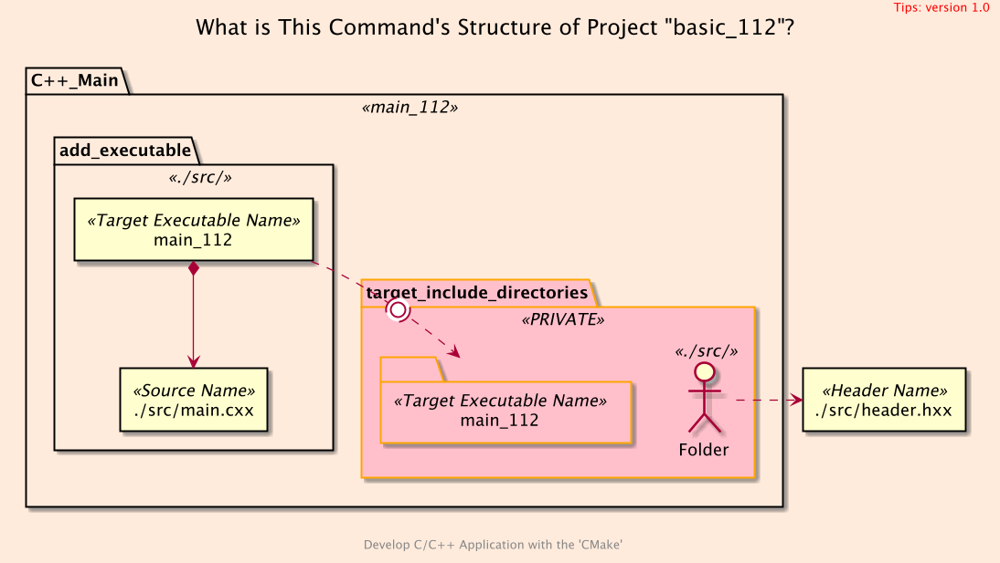
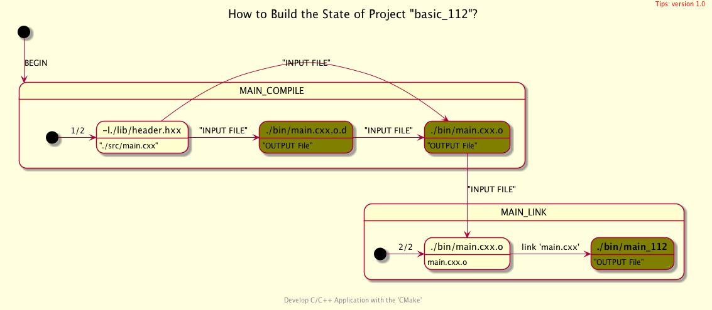

<h2>Hello, Default Include Paths!</h2>
<h3>Query the Default Include Directories with <code>CMake</code></h3>
</br>
<br/>

[@Gitter](https://gitter.im/cnruby) :gitter.im/cnruby<br/>
Code ID: basic_112</br>
Code Name: Hello, Default Include Paths!</br>
<p class ="fragment" data-audio-src="docs/112/audio/basic_112-01.m4a"></p>


<h2>TABLE of CONTENTS</h2>

- [The Structure of Project "basic_112"](#the-structure-of-project-%22basic112%22)
  - [Get The Code with Shell Commands](#get-the-code-with-shell-commands)
  - [What is The <code>Folder's</code> Structure of Project](#what-is-the-folders-structure-of-project)
  - [<code>CMake</code> Code](#cmake-code)
  - [What is The <code>Command's</code> Structure of Project](#what-is-the-commands-structure-of-project)
  - [What is The <code>Process's</code> Structure of Project](#what-is-the-processs-structure-of-project)
- [Analyze The Build of Project](#analyze-the-build-of-project)
  - [Build's Commands on <code>C++</code> Complier](#builds-commands-on-c-complier)
  - [Demonstrate Build's Process on <code>C++</code> Complier](#demonstrate-builds-process-on-c-complier)
  - [How to Graph the relationship of Build's Process](#how-to-graph-the-relationship-of-builds-process)
- [Final Summary](#final-summary)
- [References](#references)
- [The Project's Commands](#the-projects-commands)
  - [Formtting The Codes](#formtting-the-codes)
  - [Build and Run The Project](#build-and-run-the-project)
<p class ="fragment" data-audio-src="docs/112/audio/basic_112-02.m4a"></p>


## The Structure of Project "basic_112"
### Get The Code with Shell Commands
```bash
git clone https://github.com/cnruby/w3h1_cmake.git basic_112
cd basic_112
git checkout basic_112
code .
```
<p class ="fragment" data-audio-src="docs/112/audio/basic_112-03.m4a"></p>


### What is The <code>Folder's</code> Structure of Project
```bash
#<!-- markdown-exec(cmd:cat docs/tree.txt) -->#
.
├── CMakeLists.txt
└── src
   ├── CMakeLists.txt
   ├── header.hxx
   └── main.cxx
#<!-- /markdown-exec -->
```
<p class ="fragment" data-audio-src="docs/112/audio/basic_112-04.m4a"></p>


### <code>CMake</code> Code
```bash
#<!-- markdown-exec(cmd:cat src/CMakeLists.txt) -->#
add_executable(
  main_112
  main.cxx
)
#target_include_directories(
#  main_112
#  PRIVATE
#  ${PROJECT_SOURCE_DIR}/src/
#)
#<!-- /markdown-exec -->
```
<p class ="fragment" data-audio-src="docs/112/audio/basic_112-05.m4a"></p>


### What is The <code>Command's</code> Structure of Project

<p class ="fragment" data-audio-src="docs/112/audio/basic_112-06.m4a"></p>


### What is The <code>Process's</code> Structure of Project

<p class ="fragment" data-audio-src="docs/112/audio/basic_112-07.m4a"></p>


## Analyze The Build of Project
<p class ="fragment" data-audio-src="docs/112/audio/basic_112-08.m4a"></p>


### Build's Commands on <code>C++</code> Complier
```bash
#<!-- markdown-exec(cmd:cat shell/cl.sh) -->#!/bin/bash
# compile
c++  -c ./src/main.cxx -MD -MF ./bin/main.cxx.o.d \
  -o ./bin/main.cxx.o
# link
c++ ./bin/main.cxx.o  -o ./bin/main_112
#<!-- /markdown-exec -->
```
<p class ="fragment" data-audio-src="docs/112/audio/basic_112-09.m4a"></p>


### Demonstrate Build's Process on <code>C++</code> Complier
<video width="720" height="480" controls data-autoplay>
  <source src="docs/112/video/basic_112-10.mov" autoplay=true type="video/mp4">
</video>


### How to Graph the relationship of Build's Process

<p class ="fragment" data-audio-src="docs/112/audio/basic_112-11.m4a"></p>


## Final Summary

<p class ="fragment" data-audio-src="docs/112/audio/basic_112-12.m4a"></p>


<h1><!-- markdown-exec(cmd:echo "感谢大家观看!") -->感谢大家观看!<!-- /markdown-exec --></h1>

@Gitter: gitter.im/cnruby<br/>

@Github: github.com/cnruby<br/>

@Twitter: twitter.com/cnruby<br/>

@Blogspot: cnruby.blogspot.com


## References
- https://stackoverflow.com/questions/4295414/cmake-default-include-path-on-unix
- https://stackoverflow.com/questions/4980819/what-are-the-gcc-default-include-directories
- https://stackoverflow.com/questions/13703647/how-to-properly-add-include-directories-with-cmake
- https://stackoverflow.com/questions/26243169/cmake-target-include-directories-meaning-of-scope
- https://stackoverflow.com/questions/23654168/how-to-query-the-default-include-paths-of-clang/23658940
- https://marketplace.visualstudio.com/items?itemName=foxundermoon.shell-format
- https://marketplace.visualstudio.com/items?itemName=truman.autocomplate-shell


## The Project's Commands


### Formtting The Codes
```bash
ruby format-codes.rb
```


### Build and Run The Project
```bash
cmake -GNinja -Bbuild/
cmake --build build/ --clean-first -v
./bin/main_112
rm ./bin/main.* ./bin/main_*
./shell/start.sh
code ./shell/start.sh
code ./shell/cl.sh
exa -T &> docs/tree.txt
```