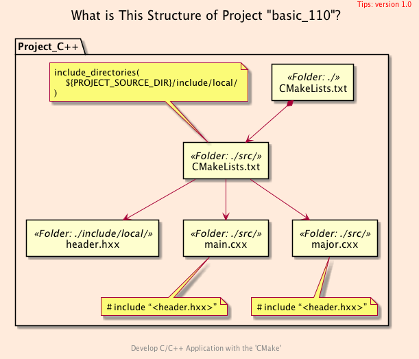

<h2>Hello, <code>Common</code> Header!</h2>
<h3>Linking a Comman Include file in <code>C++</code></h3>

[@Gitter](https://gitter.im/cnruby) :gitter.im/cnruby<br/>
Code: basic_110</br>
Nickname: Hello, Common Header!</br>
<p class ="fragment" data-audio-src="docs/110/audio/basic_110-01.m4a"></p>


* [Youtube Video](https://youtu.be/XHcIdPFaTw0)


<h2>TABLE of CONTENTS</h2>

- [What is This Structure of Project "basic_110"?](#what-is-this-structure-of-project-%22basic110%22)
  - [The Bridge Between <code>C++</code> Files and A Include File](#the-bridge-between-c-files-and-a-include-file)
  - [How to Use the <code>'include_directories'</code> Command?](#how-to-use-the-includedirectories-command)
  - [Code of The <code>'include_directories'</code> Command](#code-of-the-includedirectories-command)
  - [Demonstrate This Structure and Code of Project](#demonstrate-this-structure-and-code-of-project)
- [What does The <code>'include_directories'</code> Command mean in Compiler?](#what-does-the-includedirectories-command-mean-in-compiler)
  - [Analyse The <code>'include_directories'</code> Command](#analyse-the-includedirectories-command)
  - [Demonstrate Adding include directories to the Build](#demonstrate-adding-include-directories-to-the-build)
- [Final Summary](#final-summary)
- [References](#references)
- [The Project Command](#the-project-command)
  - [Formtting The Codes](#formtting-the-codes)
  - [Get The Code with Shell Commands](#get-the-code-with-shell-commands)
  - [Build and Run The Project](#build-and-run-the-project)
<p class ="fragment" data-audio-src="docs/110/audio/basic_110-02.m4a"></p>


## What is This Structure of Project "basic_110"?
<p class ="fragment" data-audio-src="docs/110/audio/basic_110-03.m4a"></p>



<p class ="fragment" data-audio-src="docs/110/audio/basic_110-04.m4a"></p>


### The Bridge Between <code>C++</code> Files and A Include File
<p class ="fragment" data-audio-src="docs/110/audio/basic_110-05.m4a"></p>


### How to Use the <code>'include_directories'</code> Command?

<p class ="fragment" data-audio-src="docs/110/audio/basic_110-06.m4a"></p>


### Code of The <code>'include_directories'</code> Command

```bash
#<!-- markdown-exec(cmd:cat src/CMakeLists.txt) -->#
# include_directories(
#  INCLUDE_DIR_1 INCLUDE_DIR_2 INCLUDE_DIR_N
# )
include_directories(
  ${PROJECT_SOURCE_DIR}/include/local/
)
add_executable(
  main_110
  main.cxx
)
add_executable(
  major_110
  major.cxx
)
#<!-- /markdown-exec -->
```
<p class ="fragment" data-audio-src="docs/110/audio/basic_110-07.m4a"></p>


### Demonstrate This Structure and Code of Project
<video width="720" height="480" controls data-autoplay>
  <source src="docs/110/video/basic_110-08.mp4" autoplay=true type="video/mp4">
</video>


## What does The <code>'include_directories'</code> Command mean in Compiler?
<p class ="fragment" data-audio-src="docs/110/audio/basic_110-09.m4a"></p>


### Analyse The <code>'include_directories'</code> Command
```bash
cmake --build build/ --clean-first -v
c++ --help | rg "\-(c |o <|I <)"
```
<p class ="fragment" data-audio-src="docs/110/audio/basic_110-10.m4a"></p>


### Demonstrate Adding include directories to the Build
<video width="720" height="480" controls data-autoplay>
  <source src="docs/110/video/basic_110-11.mp4" autoplay=true type="video/mp4">
</video>


## Final Summary

<p class ="fragment" data-audio-src="docs/110/audio/basic_110-12.m4a"></p>


<h1><!-- markdown-exec(cmd:echo "感谢大家观看!") -->感谢大家观看!<!-- /markdown-exec --></h1>

@Gitter: gitter.im/cnruby<br/>

@Github: github.com/cnruby<br/>

@Twitter: twitter.com/cnruby<br/>

@Blogspot: cnruby.blogspot.com


## References
- https://cmake.org/cmake/help/latest/command/include_directories.html
- https://cmake.org/cmake/help/latest/command/target_include_directories.html
- https://stackoverflow.com/questions/31969547/what-is-the-difference-between-include-directories-and-target-include-directorie
- https://stackoverflow.com/questions/26243169/cmake-target-include-directories-meaning-of-scope
- https://gitlab.kitware.com/cmake/cmake/issues/19802
- https://pabloariasal.github.io/2018/02/19/its-time-to-do-cmake-right/
- http://mariobadr.com/creating-a-header-only-library-with-cmake.html
- https://stackoverflow.com/questions/18869282/initialize-char
- https://stackoverflow.com/questions/2587349/initializing-char-and-char-pointers
- https://stackoverflow.com/questions/18963888/c-char-initialization-in-constructor
- https://stackoverflow.com/questions/13703647/how-to-properly-add-include-directories-with-cmake
- https://stackoverflow.com/questions/9834067/difference-between-char-and-const-char
- https://stackoverflow.com/questions/2186246/what-is-o-file
- https://www.online-convert.com/file-format/o


## The Project Command


### Formtting The Codes
```bash
ruby format-codes.rb
```


### Get The Code with Shell Commands
```bash
git clone https://github.com/cnruby/w3h1_cmake.git basic_110
cd basic_110
git checkout basic_110
code .
```
<p class ="fragment" data-audio-src="docs/110/audio/basic_110-05.m4a"></p>


### Build and Run The Project
```bash
cmake -GNinja -Bbuild/
cmake --build build/
./bin/main_110
./bin/major_110
```
<p class ="fragment" data-audio-src="docs/110/audio/basic_110-10.m4a"></p>
